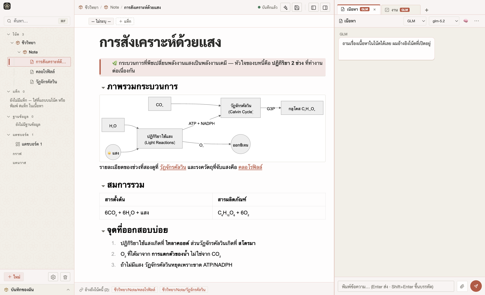
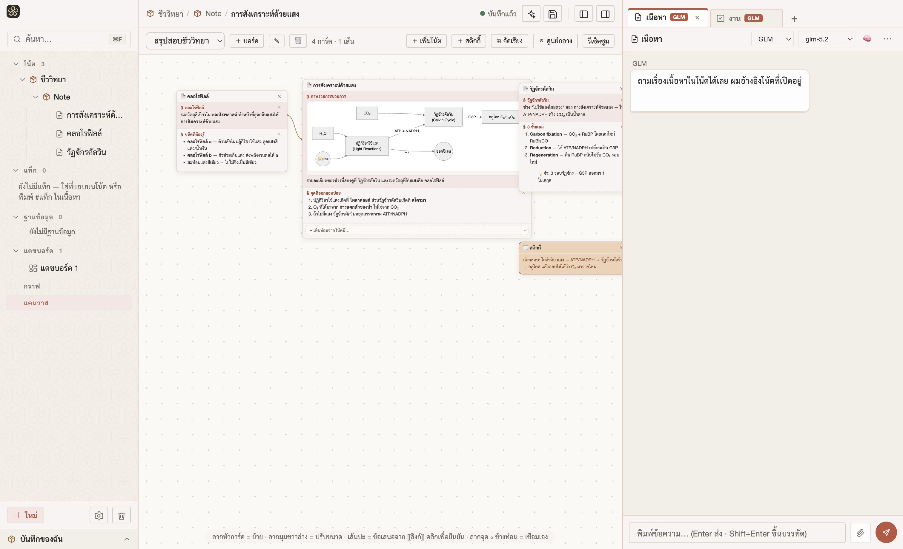

<p align="center">
  
</p>

<h1 align="center">Kumiko (組子)</h1>

<p align="center">
  แอปจดโน้ตสำหรับคนเรียนหนังสือ ที่คิดเป็นภาษาไทยตั้งแต่บรรทัดแรก<br>
  <em>A study-notes app that thinks in Thai first — Markdown notes × PDF reading × an AI that actually edits your notes.</em>
</p>

---



## ทำอะไรได้บ้าง

- **โน้ต Markdown แบบ WYSIWYG** — สไตล์ Notion: slash menu, ตาราง, callout สี, `[[wikilink]]` พร้อม backlinks, แท็กซ้อนชั้นแบบมีสี, ค้นหาทั้ง vault
- **ฐานข้อมูล + แดชบอร์ด + กราฟ + flashcards** — ฐานข้อมูล 6 ชนิดคอลัมน์ 5 มุมมอง (ตาราง/บอร์ด/ปฏิทิน/แกลเลอรี/ชาร์ต), แดชบอร์ดต่อ vault, กราฟความเชื่อมโยง, ท่องจำแบบ SM-2
- **อ่าน PDF ในแอป** — ไฮไลต์ + กล่องโน้ตบนหน้าสไลด์, แคปหน้าสไลด์เป็นภาพ (เผาไฮไลต์/โน้ตลงภาพให้เลย) ส่งเข้าโน้ตอัตโนมัติ, ระบบจำหน้าที่อ่านค้าง
- **AI เป็นผู้ช่วยจริง ไม่ใช่แค่แชท** — สร้างโน้ตใหม่, แก้โน้ตผ่านหน้ารีวิวทีละท่อน (คุณกดรับ/แก้/ทิ้งเอง), ติดแท็ก, จัดบอร์ดแคนวาส, ค้นทั้ง vault ด้วย RAG, มีชั้นความจำต่อ vault + โปรไฟล์กลางข้ามวิชา — ใช้ได้ทั้งผ่าน CLI ที่มีอยู่แล้ว (Claude Code / OpenCode+GLM ตาม subscription ของคุณ) หรือ API key
- **Kumiko Canvas** — บอร์ดสรุปงาน: หยิบ "ท่อน" ของโน้ตมาวางเป็นการ์ดเต็ม ๆ ลากจัด โยงเส้นระหว่างท่อน (เส้นแนะนำงอกเองจาก `[[ลิงก์]]` ในเนื้อหา) หลายบอร์ด สั่ง AI จัดบอร์ดได้
- **เก็บของเป็นไฟล์ล้วน** — โน้ตทั้งหมดเป็น `.md` + ภาพเป็นไฟล์ในโฟลเดอร์ vault ของคุณเอง มีประวัติเวอร์ชันอัตโนมัติ กู้คืนได้ ไม่ล็อกอิน ไม่ผูกคลาวด์
- **ลาย Kumiko แท้ 30 ลาย** — ธีมพื้นหลังจากลายฉลุไม้ญี่ปุ่น (อาซาโนฮะ ซากุระโกชิ ชิปโป ฯลฯ) สลับสว่าง/มืด
- **เว็บเซิร์ฟเวอร์ในตัว** *(ทดลอง)* — โฮสต์เองแล้วเปิดจากเบราว์เซอร์/มือถือได้ หน้าตาเดียวกับเดสก์ท็อป
- สลับ UI **ไทย ⇄ อังกฤษ** ได้ · หลาย vault แยกข้อมูลขาดจากกัน · ถังขยะกู้คืนได้



## ติดตั้ง (macOS)

```bash
git clone https://github.com/Pasawittz/kumiko.git
cd kumiko
npm install
npm run dist
open dist/mac-arm64/Kumiko.app
```

ต้องมี Node.js 20+ · สร้างเสร็จแอปจะอยู่ที่ `dist/mac-arm64/Kumiko.app` (ลากไป Applications ได้เลย) · อัปเดตรุ่นถัดไปกดปุ่มเดียวจากในแอป (Settings → เกี่ยวกับ)

**โหมด AI** เลือกได้ใน Settings:

| โหมด | ต้องมี |
|---|---|
| CLI (แนะนำ) | [Claude Code](https://claude.com/claude-code) หรือ [OpenCode](https://opencode.ai) + GLM Coding Plan ที่ล็อกอินไว้แล้ว |
| API key | คีย์ Anthropic / OpenAI-compatible ใส่ในแอป |
| Managed | ชี้ไปเซิร์ฟเวอร์ Kumiko ที่ถือคีย์ให้ (สำหรับ self-host) |

ไม่ตั้งค่า AI ก็ใช้เป็นแอปจดโน้ต + อ่าน PDF ได้ครบทุกอย่าง

## English (brief)

Kumiko is an Electron study-notes app built Thai-first: WYSIWYG Markdown notes with wikilinks/tags/databases, an in-app PDF reader whose highlights and sticky notes can be burned into captured slide images, and an AI layer that *edits your vault through a per-hunk review UI* rather than just chatting — powered by your existing Claude Code or OpenCode CLI subscription, or an API key. Kumiko Canvas turns note sections into draggable cards wired together by the `[[wikilinks]]` already in your content. Everything is plain `.md` files in your own folder, with automatic version history. Includes 30 authentic kumiko woodwork patterns as themes, and an experimental self-hostable web server.

```bash
git clone https://github.com/Pasawittz/kumiko.git && cd kumiko && npm install && npm run dist
```

## Development

```bash
npm test          # vitest — 800+ unit tests
npm start         # run unpackaged (dev)
npm run server    # self-host web server (PORT, DATA_DIR, AUTH_SECRET)
```

## License

[MIT](LICENSE)
